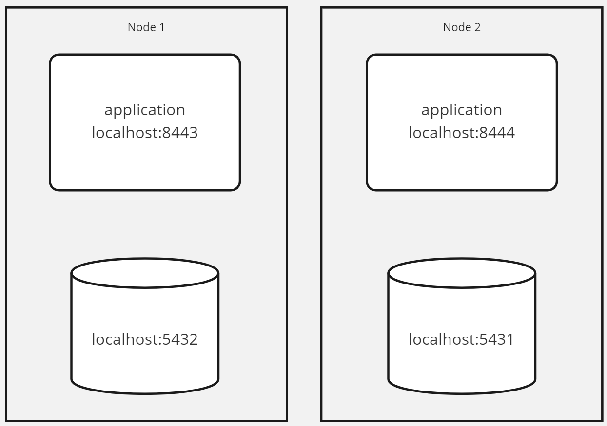

Multi node setup
==================
In order to perform cross platform transfers local two nodes must be available. This guide outlines how to setup and run 
two nodes locally in order to test cross platform transfers.

This guide outlines to setup the following setup:


Please adjust accordingly if for example you need to run on a different port or with different credentials.

##Setup the databases
the easiest way to setup and run the databases is to use docker. 
For `Node1` run the database with the following command:
```shell
docker run --name ec_registry_node1 -e POSTGRES_PASSWORD=node-1-password -e POSTGRES_USER=tdt_db_owner -e POSTGRES_DB=tdt_registry -p 5432:5432 -d postgres
```

For the second node:
```shell
docker run --name ec_registry_node2 -e POSTGRES_PASSWORD=node-2-password -e POSTGRES_USER=tdt_db_owner -e POSTGRES_DB=tdt_registry -p 5431:5432 -d postgres
```

Initialize the databases as described in: [INSTALL.md](INSTALL.md)

The end result is two databases running one on port 5432 (Postgres default port) and one running on port 5431.
Make sure the addressbook is populated on both databases. And when running the applications on different ports adjust the ebl_platform values in the addressbook accordingly!

##Setup the applications
With the databases setup two instances of the Endorcement chain application must be started each linking to one of the databases.

The easiest way to start up an instance is to use the `Spring Boot Maven plugin`.

For the first instance start up the application by issuing the following command: (inside the root directory of the repository)
```shell
PORT=8443 DATABASE_HOSTNAME=localhost DATABASE_PASSWORD=node-1-password DATABASE_PORT=5432 mvn spring-boot:run
```

The second instance can be startup with the following command:
```shell
PORT=8444 DATABASE_HOSTNAME=localhost DATABASE_PASSWORD=node-2-password DATABASE_PORT=5431 mvn spring-boot:run
```

This will run the first instance on port 8443 and the second instance on port 8444

The local setup is now ready to test cross platform transfers. Which is described in Step 3 of the [step by step guide](stepbystepguide.md)