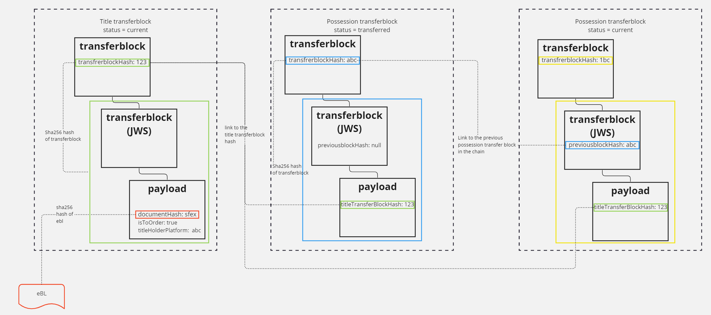

# Tranferblock

The basic tranfer block is a JWS consisting of a transferee field and a payload field. It is signed by one or more tranferrers

It is based on the JSON Serialization JWS, see https://datatracker.ietf.org/doc/html/rfc7515

Each block is consisting of:

* the transferee, identified by its public key
* a payload containing attributes such as:
    - a hash of the document whose ownership is managed
    - boolean indicating whether the eBL is to order
    - a reference to the platform to which the document is being exported
    - a reference to the platform from which the document is being imported

The block (a JWS) is signed by the transferrer, i.e. the previous transferee. This in effect creates a cryptographically linked list, functionally equivalent to the list of signatures on the paper bill of lading. For cross-platform transfers, the exporting platform's signature is added in addition to the transferrer's. 
This is depicted in the following diagram:


## Transferblock identification
Transfer blocks are identified by the hash of the transferblock. Since transferblocks are exchanged by multiple parties it is important to align on the specifics of creating the hash so all parties involved can (re)generate the same ID's referring to a particular transferblock.

Hashes of the transferblock are created with:
* UTF-8 representation of,
* Minified JSON representation of the transferblock using,
* lowercase SHA-256 algorithm

_SHA-256(UTF8(minified-transferblock.json))_

### minified JSON
A transferblock, or any JSON document can be formatted also known as 'pretty print' or compacted also known as 'minified'.

An example of a formatted transferblock:
```json
{
    "payload": "eyJ0cmFuc2ZlcmVlIjp7Imt0eSI6IlJTQSIsIm4iOiJpNzFPT0JzbkQ4a1FwakREM0pfVklCaHhkejUzXzR5M3k1NHJXTnNPQ0pSMmppLWdaMzg3Mkw1RDl5T0hxcDNCRmRoMGV4ZVh6Vl9zRlJMeTNpV1NiX0QtOWdXbkpvekdkSlNYd0c0bjZ5QVZremVIYm9vTUpfMXAzT1JvTTVSU2ZpRE5pR2gweGROTDBsXzUweUZDa09rc3ZJSUV1OC0tZWNYb2NxN3hSY0dJSFlhNnFRSlVFd0tBMmdpU2RHTVc3NjlmWVZITTA1ZnBpU0txcjR0eHVJWF9QNzRCR1JnMFNJZV9pMnRGUDBjTTBFeWFxQ3FnQlRHUGE2eDdncXM2bWlpR2tJRXhPNHZVYnRvZkJQcG0tdXN4WEdlb0QyTGwwRk9Ueld6MU1ZUXd3SXZOaFl1RmFMY3YtbW15Z25BSml1VURKdGR3eGV6NS0tRzFaU2ZDeVEiLCJlIjoiQVFBQiJ9LCJibG9ja1BheWxvYWQiOnsidGl0bGVUcmFuc2ZlckJsb2NrSGFzaCI6ImNhZGU5MzAwMjQ1MzU1ZjRhMGU4YmFmYzZlYjVkNWYyODg5YTY0MmY5YzA1OGIyY2QzYmY5MmZmZjdkNWM0N2EifX0",
    "signatures": [
        {
            "protected": "eyJhbGciOiJSUzI1NiJ9",
            "signature": "uYK8txY6QR6yjwhOHbj_L1S9akr2rLMJDQ2_1nOl3HbOCxHGANwcgwSZgxtAdyCcCi1gYBMu_PcglCuaJ_dfelcfQnGtuJd3MODJaO63rqIZasMAglhnpzVQZFDFM-H9Y_Ijd8D6FULlqHJ7TaSPGj2KGhSpxgSS5zdCL7YVoVWYRUowvAXYim0ST3-j7RHIkPp7XsyoCCI49FH2u8yAIn77MrSvtq2-ovUC5RHEtAUAGHSu3aLuhX7CFwliS8e__cVMvI5sBGpLDXPabE1ntnmkDNKyvS9Cls-xgHW1kmGZTe0Ng8WpmDssitUH3-xyMJH2p2UUsHisybCgBwkksA"
        }
    ]
}
```
When calculating the SHA-256 hash of the formatted JSON the hash would **_incorrectly_** be calculated at:
```text
Incorrect hash:
5be413941d9ce53abb99d3c51567757e918abc088cd1ddbc6ea1ed17e2097454
```

The same payload minified: 
```json
{"payload":"eyJ0cmFuc2ZlcmVlIjp7Imt0eSI6IlJTQSIsIm4iOiJpNzFPT0JzbkQ4a1FwakREM0pfVklCaHhkejUzXzR5M3k1NHJXTnNPQ0pSMmppLWdaMzg3Mkw1RDl5T0hxcDNCRmRoMGV4ZVh6Vl9zRlJMeTNpV1NiX0QtOWdXbkpvekdkSlNYd0c0bjZ5QVZremVIYm9vTUpfMXAzT1JvTTVSU2ZpRE5pR2gweGROTDBsXzUweUZDa09rc3ZJSUV1OC0tZWNYb2NxN3hSY0dJSFlhNnFRSlVFd0tBMmdpU2RHTVc3NjlmWVZITTA1ZnBpU0txcjR0eHVJWF9QNzRCR1JnMFNJZV9pMnRGUDBjTTBFeWFxQ3FnQlRHUGE2eDdncXM2bWlpR2tJRXhPNHZVYnRvZkJQcG0tdXN4WEdlb0QyTGwwRk9Ueld6MU1ZUXd3SXZOaFl1RmFMY3YtbW15Z25BSml1VURKdGR3eGV6NS0tRzFaU2ZDeVEiLCJlIjoiQVFBQiJ9LCJibG9ja1BheWxvYWQiOnsidGl0bGVUcmFuc2ZlckJsb2NrSGFzaCI6ImNhZGU5MzAwMjQ1MzU1ZjRhMGU4YmFmYzZlYjVkNWYyODg5YTY0MmY5YzA1OGIyY2QzYmY5MmZmZjdkNWM0N2EifX0","signatures":[{"protected":"eyJhbGciOiJSUzI1NiJ9","signature":"uYK8txY6QR6yjwhOHbj_L1S9akr2rLMJDQ2_1nOl3HbOCxHGANwcgwSZgxtAdyCcCi1gYBMu_PcglCuaJ_dfelcfQnGtuJd3MODJaO63rqIZasMAglhnpzVQZFDFM-H9Y_Ijd8D6FULlqHJ7TaSPGj2KGhSpxgSS5zdCL7YVoVWYRUowvAXYim0ST3-j7RHIkPp7XsyoCCI49FH2u8yAIn77MrSvtq2-ovUC5RHEtAUAGHSu3aLuhX7CFwliS8e__cVMvI5sBGpLDXPabE1ntnmkDNKyvS9Cls-xgHW1kmGZTe0Ng8WpmDssitUH3-xyMJH2p2UUsHisybCgBwkksA"}]}
```
When calculating the SHA-256 hash if the minified JSON the hash would **_correctly_** be calculated at:
```text
Correct hash:
20a0257b313ae08417e07f6555c4ec829a512c083f3ead16b41158018a22abe9
```

## Formatting the JSON is a concern of the Server
As described in the previous paragraph the hash is calculated on the minified JSON representation of the transferblock. 
However, the concern of minifying the JSON representation is the responsibility of the server. A client sending either a 
formatted or minified JSON should result in the same calculated hash. 

For example, both:
```json
{
    "payload": "eyJ0cmFuc2ZlcmVlIjp7Imt0eSI6IlJTQSIsIm4iOiJpNzFPT0JzbkQ4a1FwakREM0pfVklCaHhkejUzXzR5M3k1NHJXTnNPQ0pSMmppLWdaMzg3Mkw1RDl5T0hxcDNCRmRoMGV4ZVh6Vl9zRlJMeTNpV1NiX0QtOWdXbkpvekdkSlNYd0c0bjZ5QVZremVIYm9vTUpfMXAzT1JvTTVSU2ZpRE5pR2gweGROTDBsXzUweUZDa09rc3ZJSUV1OC0tZWNYb2NxN3hSY0dJSFlhNnFRSlVFd0tBMmdpU2RHTVc3NjlmWVZITTA1ZnBpU0txcjR0eHVJWF9QNzRCR1JnMFNJZV9pMnRGUDBjTTBFeWFxQ3FnQlRHUGE2eDdncXM2bWlpR2tJRXhPNHZVYnRvZkJQcG0tdXN4WEdlb0QyTGwwRk9Ueld6MU1ZUXd3SXZOaFl1RmFMY3YtbW15Z25BSml1VURKdGR3eGV6NS0tRzFaU2ZDeVEiLCJlIjoiQVFBQiJ9LCJibG9ja1BheWxvYWQiOnsidGl0bGVUcmFuc2ZlckJsb2NrSGFzaCI6ImNhZGU5MzAwMjQ1MzU1ZjRhMGU4YmFmYzZlYjVkNWYyODg5YTY0MmY5YzA1OGIyY2QzYmY5MmZmZjdkNWM0N2EifX0",
    "signatures": [
        {
            "protected": "eyJhbGciOiJSUzI1NiJ9",
            "signature": "uYK8txY6QR6yjwhOHbj_L1S9akr2rLMJDQ2_1nOl3HbOCxHGANwcgwSZgxtAdyCcCi1gYBMu_PcglCuaJ_dfelcfQnGtuJd3MODJaO63rqIZasMAglhnpzVQZFDFM-H9Y_Ijd8D6FULlqHJ7TaSPGj2KGhSpxgSS5zdCL7YVoVWYRUowvAXYim0ST3-j7RHIkPp7XsyoCCI49FH2u8yAIn77MrSvtq2-ovUC5RHEtAUAGHSu3aLuhX7CFwliS8e__cVMvI5sBGpLDXPabE1ntnmkDNKyvS9Cls-xgHW1kmGZTe0Ng8WpmDssitUH3-xyMJH2p2UUsHisybCgBwkksA"
        }
    ]
}
```
AND
```json
{"payload":"eyJ0cmFuc2ZlcmVlIjp7Imt0eSI6IlJTQSIsIm4iOiJpNzFPT0JzbkQ4a1FwakREM0pfVklCaHhkejUzXzR5M3k1NHJXTnNPQ0pSMmppLWdaMzg3Mkw1RDl5T0hxcDNCRmRoMGV4ZVh6Vl9zRlJMeTNpV1NiX0QtOWdXbkpvekdkSlNYd0c0bjZ5QVZremVIYm9vTUpfMXAzT1JvTTVSU2ZpRE5pR2gweGROTDBsXzUweUZDa09rc3ZJSUV1OC0tZWNYb2NxN3hSY0dJSFlhNnFRSlVFd0tBMmdpU2RHTVc3NjlmWVZITTA1ZnBpU0txcjR0eHVJWF9QNzRCR1JnMFNJZV9pMnRGUDBjTTBFeWFxQ3FnQlRHUGE2eDdncXM2bWlpR2tJRXhPNHZVYnRvZkJQcG0tdXN4WEdlb0QyTGwwRk9Ueld6MU1ZUXd3SXZOaFl1RmFMY3YtbW15Z25BSml1VURKdGR3eGV6NS0tRzFaU2ZDeVEiLCJlIjoiQVFBQiJ9LCJibG9ja1BheWxvYWQiOnsidGl0bGVUcmFuc2ZlckJsb2NrSGFzaCI6ImNhZGU5MzAwMjQ1MzU1ZjRhMGU4YmFmYzZlYjVkNWYyODg5YTY0MmY5YzA1OGIyY2QzYmY5MmZmZjdkNWM0N2EifX0","signatures":[{"protected":"eyJhbGciOiJSUzI1NiJ9","signature":"uYK8txY6QR6yjwhOHbj_L1S9akr2rLMJDQ2_1nOl3HbOCxHGANwcgwSZgxtAdyCcCi1gYBMu_PcglCuaJ_dfelcfQnGtuJd3MODJaO63rqIZasMAglhnpzVQZFDFM-H9Y_Ijd8D6FULlqHJ7TaSPGj2KGhSpxgSS5zdCL7YVoVWYRUowvAXYim0ST3-j7RHIkPp7XsyoCCI49FH2u8yAIn77MrSvtq2-ovUC5RHEtAUAGHSu3aLuhX7CFwliS8e__cVMvI5sBGpLDXPabE1ntnmkDNKyvS9Cls-xgHW1kmGZTe0Ng8WpmDssitUH3-xyMJH2p2UUsHisybCgBwkksA"}]}
```
sent by a client should result in a calculated hash:
```text
Correct hash:
20a0257b313ae08417e07f6555c4ec829a512c083f3ead16b41158018a22abe9
```